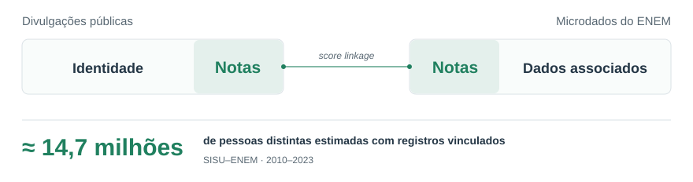

# Calculadora Nota TRI ENEM

Estime sua nota nas provas do **ENEM de 2009 a 2025** pela Teoria de Resposta
ao Item (TRI), a partir das suas respostas.

- **Impacto por questão:** veja quanto a nota mudaria ao acertar uma questão que errou.
- **Relatório PDF:** notas por área, gabarito visual e análise de acertos e erros.
- **Validação por prova:** consulte a precisão medida em participantes dos microdados do INEP.

**Use no navegador: <a href="https://notatri.com/" target="_blank" rel="noopener noreferrer">notatri.com</a>** · <a href="#executar-localmente" target="_blank" rel="noopener noreferrer">Executar localmente</a>

<p align="center">
<a href="relatorios/EXEMPLO_relatorio.pdf" target="_blank" rel="noopener noreferrer">
  <picture>
    <source media="(prefers-color-scheme: dark)" srcset="docs/imagens/exemplo-matematica-dark.svg">
    
  </picture>
</a>
</p>

Exemplo de <a href="meu_simulado.py" target="_blank" rel="noopener noreferrer"><code>meu_simulado.py</code></a> · <a href="relatorios/EXEMPLO_relatorio.pdf" target="_blank" rel="noopener noreferrer">Ver relatório completo em PDF</a>

## Como usar

Na <a href="https://notatri.com/" target="_blank" rel="noopener noreferrer">interface web</a>, selecione o ano, a aplicação, a área
e a cor do caderno. Preencha suas respostas na ordem da prova para calcular a
nota e baixar o PDF. Para Linguagens, escolha também inglês ou espanhol.

Consulte as <a href="docs/VALIDATION_REPORT.md" target="_blank" rel="noopener noreferrer">provas disponíveis e sua validação</a>.

## Executar localmente

Requer **Python 3.9 ou superior**. Os dados necessários ao cálculo já estão
incluídos no projeto; não é preciso baixar os microdados brutos do ENEM.

```bash
git clone https://github.com/HenriqueLindemann/analise-enem.git
cd analise-enem
python -m venv .venv
```

Ative o ambiente:

```bash
# Linux ou macOS
source .venv/bin/activate
```

```powershell
# Windows (PowerShell)
.venv\Scripts\Activate.ps1
```

Instale as dependências e execute o exemplo:

```bash
python -m pip install -r requirements.txt
python meu_simulado.py
```

### Preencher suas respostas

Edite as configurações no início de <a href="meu_simulado.py" target="_blank" rel="noopener noreferrer"><code>meu_simulado.py</code></a>:

- Defina `ANO`, `TIPO_APLICACAO` e a cor do caderno de cada área.
- Em cada campo `RESPOSTAS_*`, informe **45 caracteres**, na ordem das questões
  da área: `A`, `B`, `C`, `D` ou `E`. Use `.` para uma resposta em branco e
  mantenha a posição das questões anuladas.
- Para LC, escolha `LINGUA = 'ingles'` ou `LINGUA = 'espanhol'` e inclua
  somente as questões do idioma escolhido nas 45 respostas.
- Para não calcular uma área, deixe suas respostas como uma string vazia: `''`.

Execute novamente `python meu_simulado.py`. O PDF é salvo em `relatorios/`,
com nome automático. Para calcular apenas no terminal, defina
`GERAR_PDF = False`.

## Método e validação

O cálculo usa parâmetros publicados pelo INEP e é validado contra notas dos
microdados oficiais. A precisão varia por prova.

Veja o <a href="docs/SCORE_RECALCULATION.md" target="_blank" rel="noopener noreferrer">método de cálculo</a> (em inglês), as
<a href="docs/VALIDATION_REPORT.md" target="_blank" rel="noopener noreferrer">métricas por prova</a> e
<a href="relatorios/README.md" target="_blank" rel="noopener noreferrer">como interpretar o relatório</a>.

## Uso em Python

Para importar o módulo em seus próprios scripts, instale o pacote local:

```bash
python -m pip install -e .
```

```python
from tri_enem import SimuladorNota

simulador = SimuladorNota()
resultado = simulador.calcular(
    area='MT',
    ano=2021,
    respostas='DCCAEBABDDCABEACCBCCEEADDCEACDEAADCABBDBDEDCE',
    cor_prova='rosa',
    tipo_aplicacao='1a_aplicacao',
)
print(f'Nota estimada: {resultado.nota:.1f}')
```

Veja a <a href="src/tri_enem/README.md" target="_blank" rel="noopener noreferrer">documentação da API</a> e os
<a href="examples/README.md" target="_blank" rel="noopener noreferrer">exemplos de uso</a> para análises por questão e geração de PDF.

## Desenvolvimento e documentação

Para instalar as dependências de desenvolvimento e executar os testes offline:

```bash
python -m pip install -e ".[web,dev]"
python -m pytest
```

| Documento | Conteúdo |
|-----------|----------|
| <a href="relatorios/README.md" target="_blank" rel="noopener noreferrer">Relatórios</a> | Conteúdo e geração dos PDFs |
| <a href="streamlit_app/README.md" target="_blank" rel="noopener noreferrer">Interface web</a> | Execução e estrutura do aplicativo |
| <a href="tests/README.md" target="_blank" rel="noopener noreferrer">Testes</a> | Testes automatizados e validação com microdados |
| <a href="tools/README.md" target="_blank" rel="noopener noreferrer">Ferramentas</a> | Preparação dos dados e recalibração |
| <a href="docs/README.md" target="_blank" rel="noopener noreferrer">Documentação técnica</a> | Método e resultados de validação |

Sugestões, relatos de problemas e contribuições são bem-vindos. Veja
<a href="CONTRIBUTING.md" target="_blank" rel="noopener noreferrer">CONTRIBUTING.md</a> para orientações.

## Autor e licença

Desenvolvido por **Henrique Lindemann**, Engenharia de Computação, UFRGS.
<a href="https://www.linkedin.com/in/henriquelindemann/" target="_blank" rel="noopener noreferrer">LinkedIn</a>.

Disponibilizado sob a licença
<a href="LICENSE" target="_blank" rel="noopener noreferrer">PolyForm Noncommercial 1.0.0</a>, para uso não comercial conforme os
termos da licença.

**Trabalho relacionado:** <a href="https://doi.org/10.1016/j.cose.2026.105080" target="_blank" rel="noopener noreferrer">Knowing millions of students too well</a>,
sobre privacidade nos microdados do ENEM (*Computers & Security*, 2026).

<p align="center">
<a href="https://doi.org/10.1016/j.cose.2026.105080" target="_blank" rel="noopener noreferrer">
  <picture>
    <source media="(prefers-color-scheme: dark)" srcset="docs/imagens/artigo-score-linkage-dark.svg">
    
  </picture>
</a>
</p>
