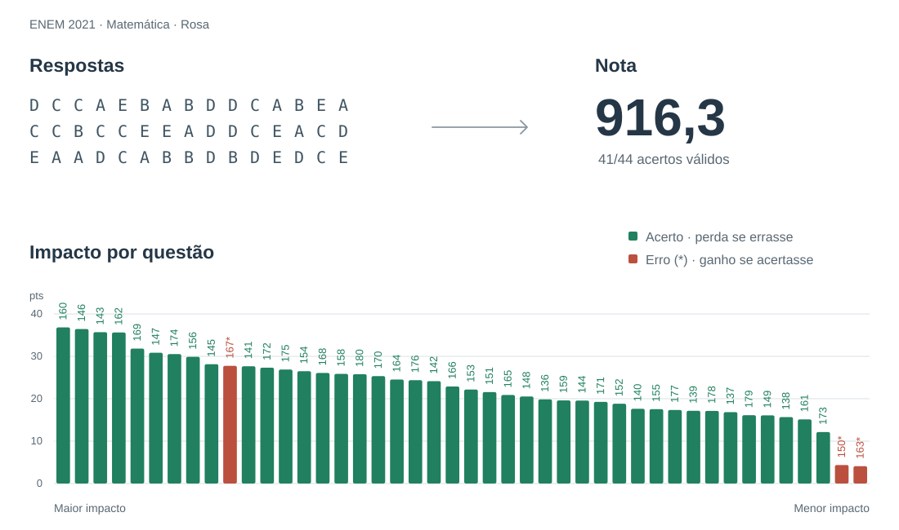

# Calculadora Nota TRI ENEM

Estime sua nota nas provas do **ENEM de 2009 a 2025** pela Teoria de Resposta
ao Item (TRI), a partir das suas respostas.

- **Impacto por questão:** veja quanto a nota mudaria ao acertar uma questão que errou.
- **Relatório PDF:** notas por área, gabarito visual e análise de acertos e erros.
- **Validação por prova:** consulte a precisão medida em participantes dos microdados do INEP.

**Use no navegador: [notatri.com](https://notatri.com/)** · [Executar localmente](#executar-localmente)

<a href="relatorios/EXEMPLO_relatorio.pdf">
  <picture>
    <source media="(prefers-color-scheme: dark)" srcset="docs/imagens/exemplo-matematica-dark.svg">
    
  </picture>
</a>

Exemplo de [`meu_simulado.py`](meu_simulado.py) · [Ver relatório completo em PDF](relatorios/EXEMPLO_relatorio.pdf)

## Como usar

Na [interface web](https://notatri.com/), selecione o ano, a aplicação, a área
e a cor do caderno. Preencha suas respostas na ordem da prova para calcular a
nota e baixar o PDF. Para Linguagens, escolha também inglês ou espanhol.

Consulte as [provas disponíveis e sua validação](docs/VALIDATION_REPORT.md).

## Executar localmente

Requer **Python 3.9 ou superior**. Os dados necessários ao cálculo já estão
incluídos no projeto; não é preciso baixar os microdados brutos do ENEM.

```bash
git clone https://github.com/HenriqueLindemann/analise-enem.git
cd analise-enem
python -m venv .venv
```

Ative o ambiente:

```bash
# Linux ou macOS
source .venv/bin/activate
```

```powershell
# Windows (PowerShell)
.venv\Scripts\Activate.ps1
```

Instale as dependências e execute o exemplo:

```bash
python -m pip install -r requirements.txt
python meu_simulado.py
```

### Preencher suas respostas

Edite as configurações no início de [`meu_simulado.py`](meu_simulado.py):

- Defina `ANO`, `TIPO_APLICACAO` e a cor do caderno de cada área.
- Em cada campo `RESPOSTAS_*`, informe **45 caracteres**, na ordem das questões
  da área: `A`, `B`, `C`, `D` ou `E`. Use `.` para uma resposta em branco e
  mantenha a posição das questões anuladas.
- Para LC, escolha `LINGUA = 'ingles'` ou `LINGUA = 'espanhol'` e inclua
  somente as questões do idioma escolhido nas 45 respostas.
- Para não calcular uma área, deixe suas respostas como uma string vazia: `''`.

Execute novamente `python meu_simulado.py`. O PDF é salvo em `relatorios/`,
com nome automático. Para calcular apenas no terminal, defina
`GERAR_PDF = False`.

## Método e validação

O cálculo usa parâmetros publicados pelo INEP e é validado contra notas dos
microdados oficiais. A precisão varia por prova.

Veja o [método de cálculo](docs/SCORE_RECALCULATION.md) (em inglês), as
[métricas por prova](docs/VALIDATION_REPORT.md) e
[como interpretar o relatório](relatorios/README.md).

## Uso em Python

Para importar o módulo em seus próprios scripts, instale o pacote local:

```bash
python -m pip install -e .
```

```python
from tri_enem import SimuladorNota

simulador = SimuladorNota()
resultado = simulador.calcular(
    area='MT',
    ano=2021,
    respostas='DCCAEBABDDCABEACCBCCEEADDCEACDEAADCABBDBDEDCE',
    cor_prova='rosa',
    tipo_aplicacao='1a_aplicacao',
)
print(f'Nota estimada: {resultado.nota:.1f}')
```

Veja a [documentação da API](src/tri_enem/README.md) e os
[exemplos de uso](examples/README.md) para análises por questão e geração de PDF.

## Desenvolvimento e documentação

Para instalar as dependências de desenvolvimento e executar os testes offline:

```bash
python -m pip install -e ".[web,dev]"
python -m pytest
```

| Documento | Conteúdo |
|-----------|----------|
| [Relatórios](relatorios/README.md) | Conteúdo e geração dos PDFs |
| [Interface web](streamlit_app/README.md) | Execução e estrutura do aplicativo |
| [Testes](tests/README.md) | Testes automatizados e validação com microdados |
| [Ferramentas](tools/README.md) | Preparação dos dados e recalibração |
| [Documentação técnica](docs/README.md) | Método e resultados de validação |

Sugestões, relatos de problemas e contribuições são bem-vindos. Veja
[CONTRIBUTING.md](CONTRIBUTING.md) para orientações.

## Autor e licença

Desenvolvido por **Henrique Lindemann**, Engenharia de Computação, UFRGS.
[LinkedIn](https://www.linkedin.com/in/henriquelindemann/).

Disponibilizado sob a licença
[PolyForm Noncommercial 1.0.0](LICENSE), para uso não comercial conforme os
termos da licença.
